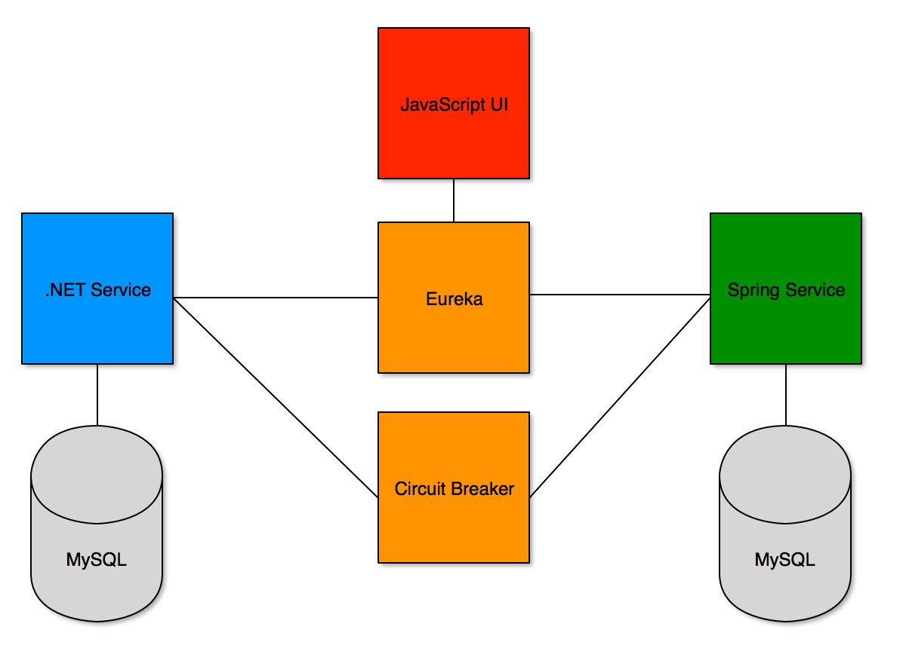

# Questrade PCF Developers Workshop

## Introduction

In this module we will discuss what we will keep in mind while putting together out Product.

## What is the Strategic Goals?

What is "the business" looking to achieve with this product? Entrance into a new market? Beat a competator to market with a specific feature? Its important that the business stay connected to process and development and operations create frequent releases to get their feedback.

Examples of Strategic Goals:
- Enable Scalable Business
- Support Entry into New markets
- Support Innovation in New Markets

## What is a Principle?

Principles are rules we follow to help ensure the product we are creating will successfully achieve our business goals. For example the business goal of entrance into a new global market may require a principle for the entire stack to run locally in that geographic region.

Examples of principles:
- Reduce Inertia
- Eliminate Accidential Complexity
- Consistent Interfaces and Data Flow
- No Silver Bullets

For example 12 Factor (http://12factor.net/) contains some principles that will ensure applications work well in a buildpack environment.

## What is a Practice?

Detailed guidance for completing the principles. These can include coding guidelines, integration patterns, data model approaches. Practises may change over time and may be affected by constraints of the organization and could very well differ per programming language.

Examples of practises:
- Standard is REST/HTTP
- Small Independant Services
- Continous Deployment
- Encapsulate Legacy
- Eliminate Integration Databases

_Reference: Examples taken from Building Microservices written by Sam Newton and published by O'Reilly_

## What we are building?

Luke
